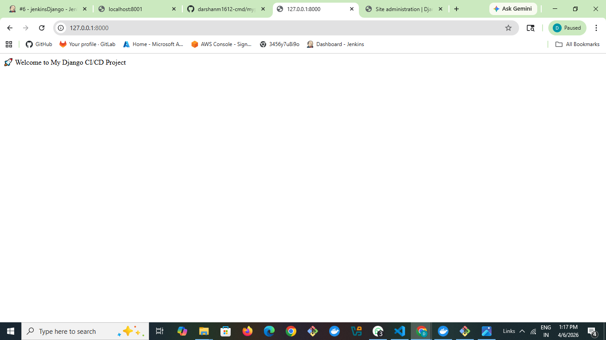
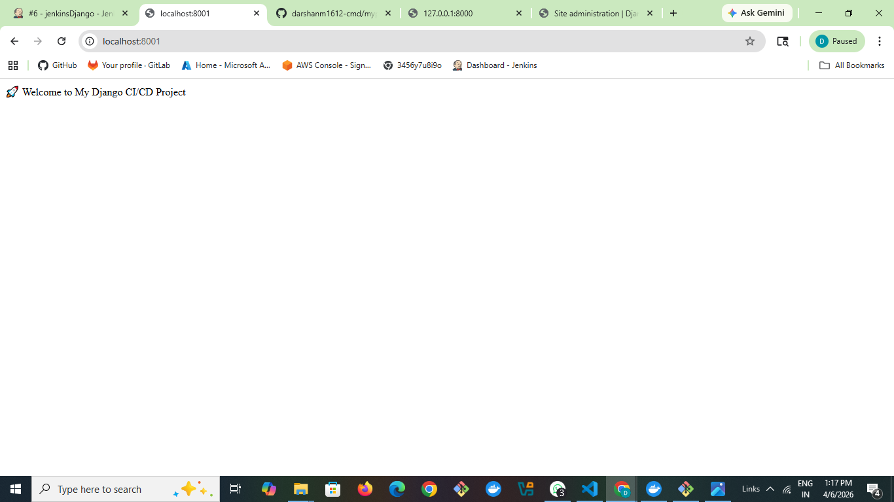
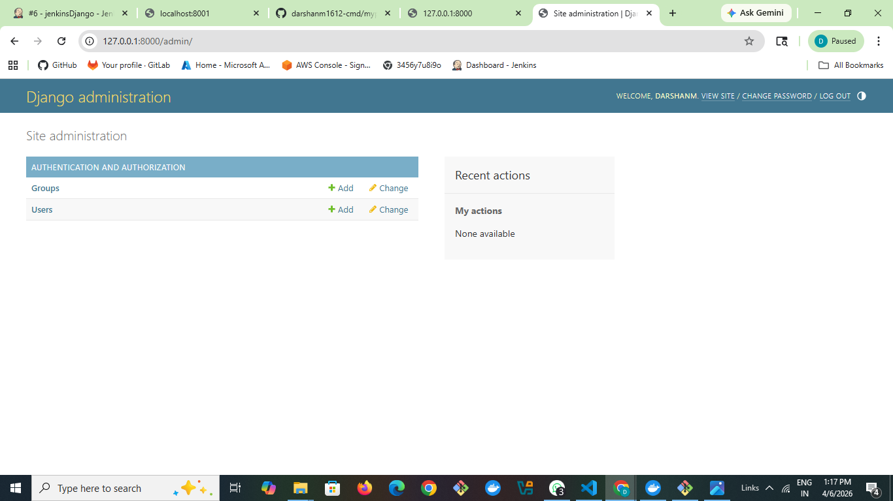
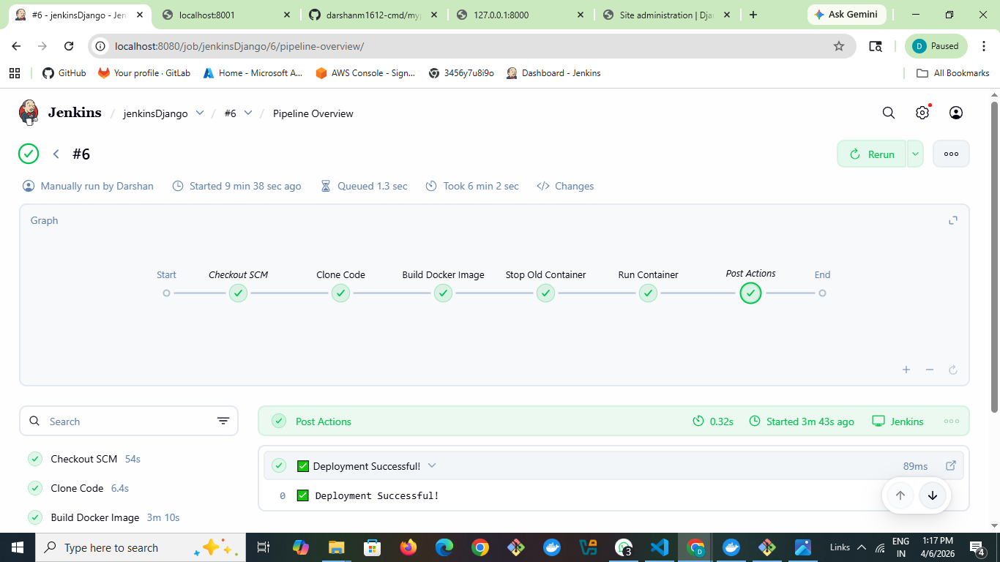
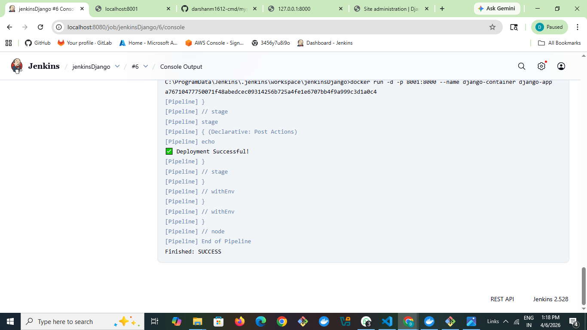

# myproject
# 🚀 Django CI/CD Project

## 📌 Description
This project is a Django web application deployed using Docker and automated using Jenkins CI/CD pipeline.

## ⚙️ Technologies Used
- Python
- Django
- Docker
- Jenkins
- GitHub

## ▶️ How to Run

### Run Locally
python manage.py runserver

Open:
http://127.0.0.1:8000

### Run with Docker
docker build -t django-app .
docker run -d -p 8001:8000 django-app

Open:
http://localhost:8001

## 📸 Screenshots

### Application (Local)

### Application (Docker)

### Admin Dashboard

### Jenkins Pipeline

### Jenkins Console

